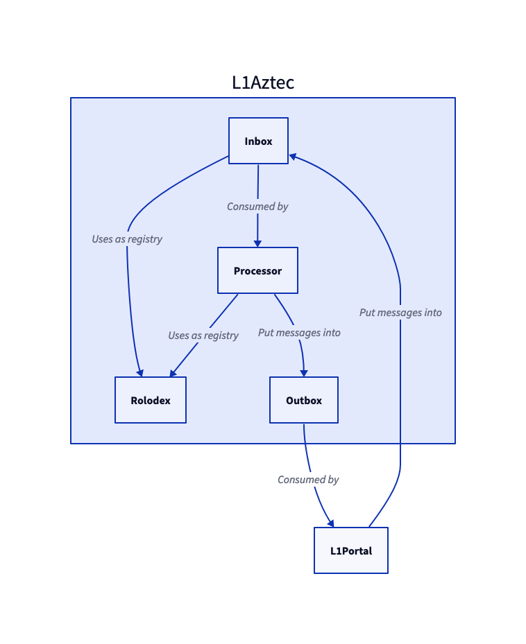

# Aztec 3 contracts

>Beware that half of the comments in here are mainly for myself (LHerskind) as this is super early stage of the repo.

Message is a bad word. It can mean anything. We need to be more clear about where a "message" lives and give it separate names to easily distinguish between them. 

# L1 <-> L2 Communication

https://hackmd.io/@aztec-network/Hk6rJkUOs?type=view

Let `l1Inbox` be the L1 contract that portals can insert messages into FROM L1. e.g., initiate L1 -> L2 messages. 
Let `l1Outbox` be the L1 contract that the rollup will insert messages FROM L2 into. e.g., receive L2 -> L1 messages.

Let the `Rolodex` be a registry of L1 <-> L2 contract links, e.g., `Rolodex::portal(l2Address)` is the l2Address corresponding portal address and `Rolodex::l2Address(portal)` the opposite.

## What differs from the spec (+ additions)?
- A "message" is the tuple `(l2Address, sha256(messageData))` instead of changing depending on where it is..
- We *never* "remove" things from the `l1Inbox` we just keep track of far in the queue we have come to save gas. 
- An `l1InboxEntry` in the `l1Inbox` is inserted by the portal at the next available index, and is `keccak(portalAddress, block.chainid, sha256(message))`. When the rollup is "consuming" these entries, it is provided provided messages ()`l2Address` and `sha256(messageData)`) as part of the public inputs. It will then validate that the `n` provided pairs match the `n` next entries from `l1Inbox` as `entry == keccak(Rolodex::portal(l2Address), block.chainid, sha256(messageData))` and reverts if there is a mismatch, if no revert move the "starting point" `n` forward on the `l1Inbox`.
- The `Inbox` must ensure that no messages from non-portals are inserted. Duplicates don't impact it as they are inserted after each other in order (emulating a list).
- The entries suggested in the spec will make all calls from same L2 contract overwrite each other.
- An `l1OutboxEntry` in the `l1Outbox` is the tuple `(callerAddress, exists)` and is inserted at `key = keccak256(portalAddress, sha256(messageData))`. It is inserted by the rollup processor when processing a rollup and as before include messages (`l2Address, sha256(messageData)`) but also an extra `caller` (senderAddress in spec) in the public inputs. The rollup contract uses the `Rolodex` to fetch portal addresses.
  - Consider whether to revert or not if `portal == address(0)`, if allowing it, we might have an easier time battling censorship, without having to let the L2 know about the specific portal addresses at all.
- To support the `caller`, we add a "push-style" interaction on the `Outbox` called `designatedConsume`, the designated consume can only be called by the `caller` address at the entry, and will "delete" the caller from the entry and perform a call to the portal with the provided calldata. If the entry still `exists` after the call, the function will revert. This can potentially be dangerous, as the attacker can pass whatever he wish in `_data` which is called on the `portal` as long as it consumes the provided entry. If a portal is made with bad access control (allow outbox everything) and can be re-entered, an attacker could use that to perform an attack and still consume the entry.
