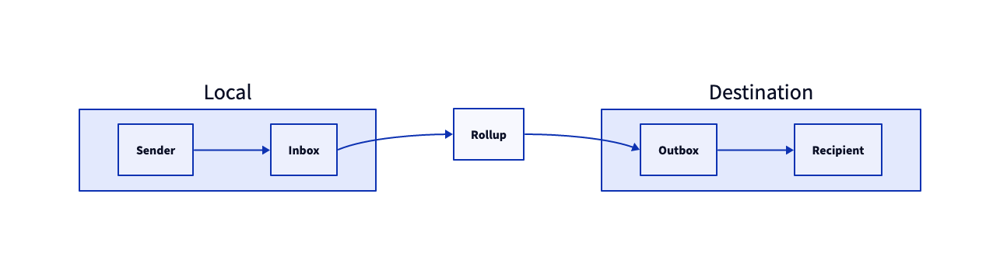
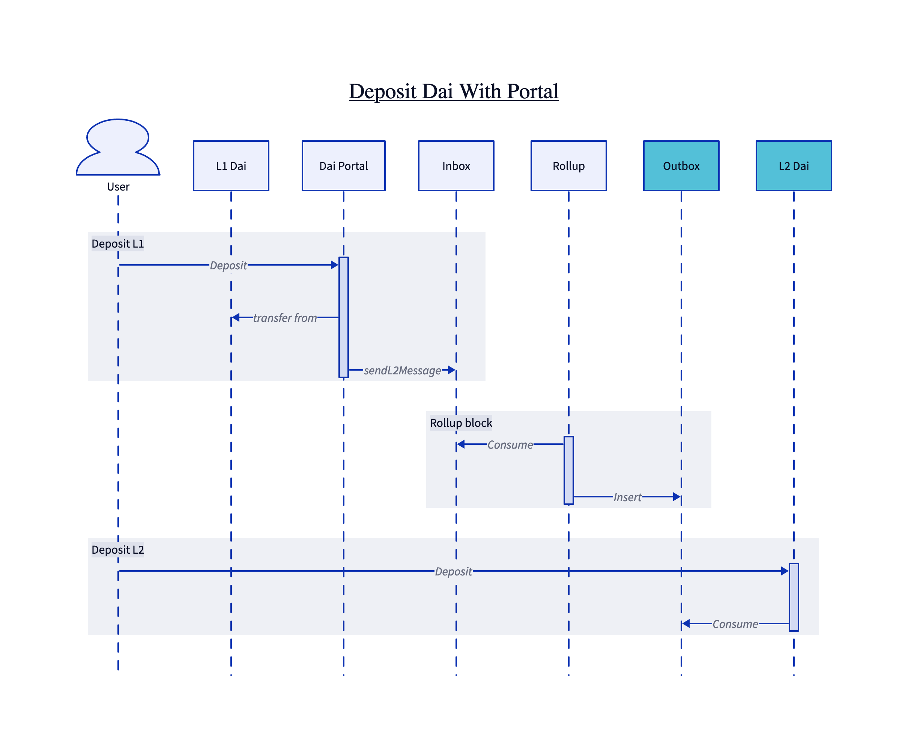
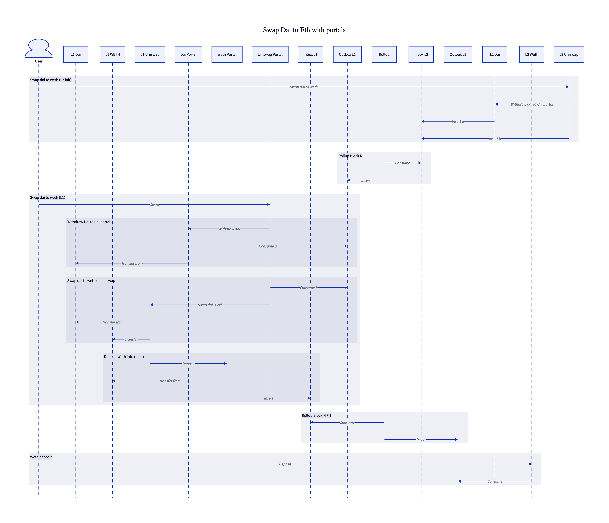

# Aztec 3 contracts

>Beware that half of the comments in here are mainly for myself (LHerskind) as this is super early stage of the repo.

- [ ] The implementation currently don't enforce 256 bytes as this idea was discussed with Mike earlier today.

Message is a bad word. It can mean anything. We need to be more clear about where a "message" lives and give it separate names to easily distinguish between them. 

https://hackmd.io/@aztec-network/Hk6rJkUOs?type=view


# Codename Chiaroscuro: Crosschain Contracts

> Note: In process of investigating if we can just pass bytes, or need to be a hash. Below going with bytes.

## Introduction
Aztec 3 will provide developers with a way to build private contracts that live on the Aztec L2 (Aztec Network?). While layer 2's have seen growing interest over time, onboarding of large ethereum protocols and value pose a significant hurdle with the largest protocol on Arbitrum (GMX) have ~1/3 of the total value locked (USD) and the entire chain still being smaller than multiple L1 protocols.

Aztec Connect have shown that users are interested in privacy that interacts with battle-tested layer 1 protocols, such as Lido which have seen more than \$50M volume since AC launch last July, all while enforcing small deposit limits.

Aztec 3 wants to enable developers to throw away the constrains from Aztec Connect and use L1 contracts inside the contract in a ergonomic manner.

This document will outline the message passing design that let developers communicate across chains without adding significant trust assumptions or deteriate developer experience.

## Objectives
What is the minimal-complexity mechanism that allow L1 and L2 to communicate such that:
- L2 functions can "call" functions on L1 contracts
- L1 functions can "call" functions on L2 contracts
- It is possible to make portals such that "bundles" of multiple calls with internal ordering can be supported (example, exit with tokens, swap on uniswap and enter again). 
- Contract developers can easily reason about portal contracts and use the portal as the starting point

## High-level overview
All communication that cross the L1<->L2 boundary goes through the rollup, and is enabled through message passing. 

Our design differs from most other rollups because:
- L1 and L2 contracts are linked in pairs, while only allowing contracts to be in one pair;
- Only paired contracts can "talk";
- Our local and destination domains have different execution environments. Actions that are cheap on ethereum (keccak) is expensive inside the rollup and vice-versa. 

We are supporting this, through a set of message boxes, namely for each domain, we have an `inbox` and an `outbox` that belong to the rollup contract. 

Similarly to how other people can add mails to your `inbox`, contracts (that are in a pair) can add an entry to the `inbox` of the Rollup. The Rollup then reads the entry, find the other part of the pair and put the entry into its `outbox` on the opposite domain. On the opposite domain, there is now an entry "to" the recipient, inside the rollup outbox, and the recipient can then `consume` this waiting entry. 

An example could be a 2-step token "bridge", where an L1 and L2 pair is matched and the user will first deposit into the contract, then later "claim" the notes in the rollup. Here the L1 contract will add a "deposit" entry into the L1 inbox of the rollup. At some point, a sequencer will include the entry in a block, and it will be read by the rollup (deleted from the L1 inbox) and added to the L2 outbox. The user can at this point go to L2, and send a transaction that consumes the message from the L2 outbox. At this point, the user now have funds inside the rollup, and can do the reverse flow for exiting. A more extensive example of this is seen later again.

# Messaging Details

As should be made clear by the figure below, passing messages from L1 to L2 or from L2 to L1 is symmetrical, and we can support message passing in both directions, you can have two "logically" identical bridges with different implementations. Implementations differing as one direction will start ethereum-friendly and end snark-friendly and vice-versa.



With the rollup being a contract whose state lives on Ethereum L1, the state is only updated by mutating transactions which for Aztec 3 will be processing a rollup block. Inherently, this means that new elements will only be inserted into the outbox (be it L1 or L2) when processing a rollup block. A transaction that triggers an L2 to call something on L1 will therefore not be able to reason about the result before a rollup have been processed that put a response into the outbox, which at the earliest could be in the next rollup.

To ensure logical separation the `inbox` and `outbox` on ethereum L1 is handled in contracts separate to the rollup. Similarly, the "registry" that keeps track of the links is held outside the rollup contract itself. We refer to this registry as the [Rolodex](https://en.wikipedia.org/wiki/Rolodex), a small device for storing contact information.

Because any message being "passed across the chains" is done as part of rollup execution, we have the ability to enforce checks and transformations at the time of "communication". This allows us to create a design where the in-transit message is kept merely as raw "bytes" and we can use locally "cheap" hashing functions to ensure correctness with a small storage overhead. 

A message being passed between the two "chains" have the following form:
```json
{
  AztecAddress: participant, // The L2 Aztec Address of the interacting contract
  bytes256: MessageData,     // The raw bytes being passed (256 bytes padded with zeros)
}
```
Because we keep track of the pairs in the Rolodex on L1, we can at the time of rollup execution ensure that the message is always from/to the matching L1 portal contract. This is mainly a useful slight of hand, as the Aztec Rollup don't need to keep track of the pairs, it can rely on the ethereum contract performing that task. 

To create an upper bound on the proving cost for including individual messages, the `MessageData` is limited to be 256 bytes (8 words) padded with zeros. This makes the full message be 9 words long. If more data is to be passed, it can either be split across multiple messages, or a commitment to the message could be computed and passed along.

> Inserting new pairs into the rolodex is a separate problem, not covered in this document.

--- 

In the following sections, we dive more into the details of the boxes themselves.

Generally, the messages will not be stored directly, but instead committed to and revealed to the rollup contract at point of inclusion. As the messages will be generated as part of contracts, the messages will often be known publicly much earlier than point of inclusion, it is merely a way to limit overheads when "storing" the data. Furthermore, for the L1 part of these actions, we need additional metadata. To make the naming schemes less confusing, we will use `Entry` for the elements inserted into the databases, instead of messages, with the message containing the actual content directly.

## L1 messaging L2

Both inbox and outbox on L1 uses a multi-set implementation to keep track of entries. For a multi-set, the same entry can be contained multiple times and the L1 portal contracts MUST not assume that entries are unique at any time. 

### L1 Inbox

Each entry is modelled as the struct `L1InboxEntry` seen below, but only the hash of the entry `keccak256` is used for keeping track of the entry and its  multiplicity in the set (#occurrences), the reasoning being that storage is really expensive so we rather commit to the data and store only the commitment, and then we can disclose all information and compute the information again when we want to consume it. The fee is the amount of ether that the sequencer is paid for including the message (and consume the entry). As L1 -> L2 interactions will most likely include some asset transfer, it should be possible for the depositor to "cancel" his entry after some deadline if it have not been included yet, the logic to give him back his assets must be handled by the portal, see Handling errors.

```solidity
struct L1InboxEntry{
  address portal;
  uint256 deadline;
  uint256 fee;
  bytes content;
}
```

Any contract listed as a portal in the Rolodex is able to create entires in the L1 Inbox. Written as a solidity interface, we can insert messages into the Inbox as:
```solidity
  /**
   * @notice Inserts an entry into the Inbox
   * @dev Only callable by contracts that are portals according to the Rolodex
   * @dev msg.value - The fee provided to sequencer for including the entry
   * @param _deadline - The timestamp after which the entry can be cancelled
   * @param _content - The content of the entry (application specific)
   * @return The key of the entry in the set
   */
  function sendL2Message(uint256 _deadline, bytes memory _content) external payable returns (bytes32);
```

By letting the `Inbox` emit an event with the committed data whenever an insertion is made, we can make it very easy for block builders (sequencers) to find eligible L1 -> L2 calls that it can include. And it can then use the fee to figure out if inclusion is worth it. When the deadline have passed, the entry can still be included by a sequencer, but the portal has the ability to cancel it, so the sequencer might generate a proof that will invalidate when it hits the chain if he includes "stale" entries. Note that only the portal can cancel the message, as it have to handle possible unwinding logic, see Handling errors.

> Note: As the entry includes the fee, duplicates should be fairly rate, but if duplicates exists, the sequencer have an incentive to include as many as possible as his profit margin will increase due to gas pricing mechanics of ethereum.

Finally, whenever a rollup with L1 -> L2 calls is processed, the sequencer will pass (l2Portal, deadline, fee, content) as part of the calldata (with l2Address and content being part of public inputs):

The deadline and fee used to compute what entry to consume, it can be passed as "auxData" and don't need to be part of the public inputs to the proof, similarly to signatures on deposits in Aztec Connect. Notice that we are passing in the l2Portal aztec address and not the ethereum address, we then use the Rolodex to compute the portal address (which gives us the L1InboxEntry) and the rollup simply reverts if the addresses are not a pair.

The entries are then inserted into the L2 outbox, for consumption by L2 contracts.

### L2 Outbox

As the L2 outbox lives on L2, it is not a solidity contract. It will instead store the messages in an append-only data tree whose leafs are computes as `hash(l2Address, content)`. 

As mentioned earlier, when rollup is processed and insertions into the L2 outbox is required, the `(l2Address, content)` is passed as public inputs, and the leaf can be computed and inserted as part of the rollup proof. Because the raw 256 bytes are passed along we can use a snark-friendly hash.

Whenever a message is consumed by a contract on L2, its nullifier is added to a nullifier tree.

> Note: The nullifier should probably depend on index in the tree to ensure that duplicates can be executed. There is still race-conditions, but at least the "slower" should be able to consume the message in this model.


## L2 messaging L1
### L2 Inbox

The L2 inbox will similarly to the L1 Inbox, allow insertions by its local contracts (L2 contracts), and be consumed by the rollup. Similar to the L2 outbox, it will use a append-only data tree whose leafs are computes as `hash(l2Address, content)`. We do not need to explicitly check that the contract have a paired portal contract inside the circuit, as the entry if not paired would only be consumable by address 0. 

While the interface is not fully clear, it should be similar in to the L1 contract to make the flow symmetric

As for the L1 inbox, it is only the Rollup that can consume these messages, and such is done as part of processing a new block. The proof mush ensure that the entries provided to the rollup is part of the inbox tree, and that they are nullified, before inserting the entries into the L1 outbox.

> Should consider if we also need stuff like the deadline and fee ones used on L1. We need to pay for it somehow from L2 as well, so might be possible to just do it very symmetric.

### L1 Outbox

The rollup contract is the only entity that MUST write to the outbox. The structure of writes are similar to the inbox, where hash of an entry is added to the multi-set. Nevertheless, the entry itself differs as it is just (portal, content). Portals are then able to consume any messages where they are the intended recipient.

Whenever a rollup with L2 -> L1 calls is processed, the sequencer will be passing (l2Address, content) as public inputs and as before use the Rolodex to find the portal address to match with. The proof should ensure that it is really an entry in the L2 Inbox, and then consume that (nullifier).

## Sequencers 

### Fees 

## Handling errors 

Error handling when moving cross chain can quickly get tricky. Because the L1 and L2 calls are practically async and independent of each other, the L2 part of a withdraw might execute just fine, with the L1 part failing. If not handling this well, the funds might be lost forever. The contract builder should therefore consider in what ways his application can fail crosschain, and handle those cases explicitly. 

First, entries in the outboxes SHOULD only be consumed if the execution is successful. For an L2 -> L1 call, the L1 execution can revert the transaction completely if anything fails. As the tx can be atomic, the failure also reverts the consumption of the entry. 

If it is possible to enter a state where the second part of the execution fails forever, the application builder should consider including additional failure mechanisms.

For L1 -> L2 calls, a badly priced L1 deposit, could lead to funds being locked in the bridge, but the message never leaving the L1 inbox. The inbox supports cancelling after a deadline, and it is the job of the application builder to honor this cancellation and revert the state. 

Generally, it is good practice, to keep cross-chain calls simple to avoid too many edge cases and state reversions. 

## Standards

### Message data

To avoid collisions across functions, cross-chain calls should prepend the function selector.

### Caller - Ordering

Ordering and batching of multiple L2 -> L1 calls can be very useful for building trustless interactions with L1 contracts that are entirely controlled from L2. 

When doing complex cross-calls, such as a uniswap trade, there will be interactions with multiple L2 and L1 contracts, tokens needs to leave the rollup, get swap and another token should enter. But the order is not meaningless, the swap will fail if not the funds are there first, and we can send funds back before executing a swap. 

Because only the portals can execute message meant for it, we suggest to include a "caller" as part of the message data. Then as a precondition to consume the message the portal should check that the `msg.sender == caller`. The implementation is fairly simple, let `address(0)` be the base-case where anyone can call, then any portal function consuming an entry should take a `_withCaller` flag. If the flag is set insert `msg.sender` into the entry to consume, otherwise `address(0)`
```solidity
bytes memory message = abi.encodeWithSignature(
  "withdraw(uint256,address,address)", _amount, _to, _withCaller ? msg.sender : address(0)
);
```
A simple example seen above. 

# Examples 

## Token Bridge

> See `TokenPortal.sol`

Token bridges are probably the most well known cross-chain application. The idea is simple, take an asset that live on one domain, and create a representation of it on a destination domain. For the bridge to be useful, it should only let you "mint" tokens on the destination if you lock valuable assets on the local domain. For the case of dai on ethereum, this means that you lock up dai in a contract on ethereum and are provided dai inside Aztec. You generally want the bridge to be as simple as possible, and for one implementation to become the dominant one to work around liquidity fragmentation. Below is a sequence diagram outlining the interactions to deposit dai into the Aztec 3 rollup using a single portal contract(light blue square is L1, dark blue L2).



Using the example implementation of the Inbox, a deposit function on L1 can be implemented as such:
```
  /**
   * @notice Deposit funds into the portal and adds an L2 message.
   * @dev Includes a selector to easily distinguish messages types
   * @dev Appends the msg.sender to message to support cancelling if stale
   * @param _amount - The amount to deposit
   * @param _to - The aztec address of the recipient
   * @param _caller - The aztec address that can execute on L2, bytes32(0) for anyone
   * @param _deadline - The timestamp after which the entry can be cancelled
   * @param _canceller - The eth address of the account that can cancel the message after deadline
   * @return The key of the entry in the Inbox
   */
  function deposit(
    uint256 _amount,
    bytes32 _to,
    bytes32 _caller,
    uint256 _deadline,
    address _canceller
  ) external payable returns (bytes32) {
    bytes memory message = abi.encodeWithSignature(
      "deposit(uint256,bytes32,bytes32,address)", _amount, _to, _caller, _canceller
    );
    ASSET.safeTransferFrom(msg.sender, address(this), _amount);
    return INBOX.sendL2Message{value: msg.value}(_deadline, message);
  }
```
Notice that we are including 


> An implementation of a L2 contract is not provided for now.

A bridge is only as good as its ability to reclaim assets pledged to the other chain. While we don't provide an L2 contract for exiting yet. We can simulate it by adding entries to the outbox directly from the rollup, and then use the implementation seen below for consuming and withdrawing funds from 

```solidity
  /**
   * @notice Withdraw funds from the portal
   * @dev Will revert if not consuming an entry in the Outbox
   * @param _amount - The amount to withdraw
   * @param _to - The ethereum address of the recipient
   * @param _withCaller - Flag to use `msg.sender` as caller, otherwise using address(0)
   * @dev If caller specified from L2, must use `_withCaller = true` and be correct caller to not revert
   */
  function withdraw(uint256 _amount, address _to, bool _withCaller) external {
    // Including selector as message separator
    bytes memory message = abi.encodeWithSignature(
      "withdraw(uint256,address,address)", _amount, _to, _withCaller ? msg.sender : address(0)
    );
    OUTBOX.consume(message);
    ASSET.safeTransfer(_to, _amount);
  }
```

## Uniswap




# What does the Rollup See 
# What does the L1 Contract see
# What does the L2 contract see